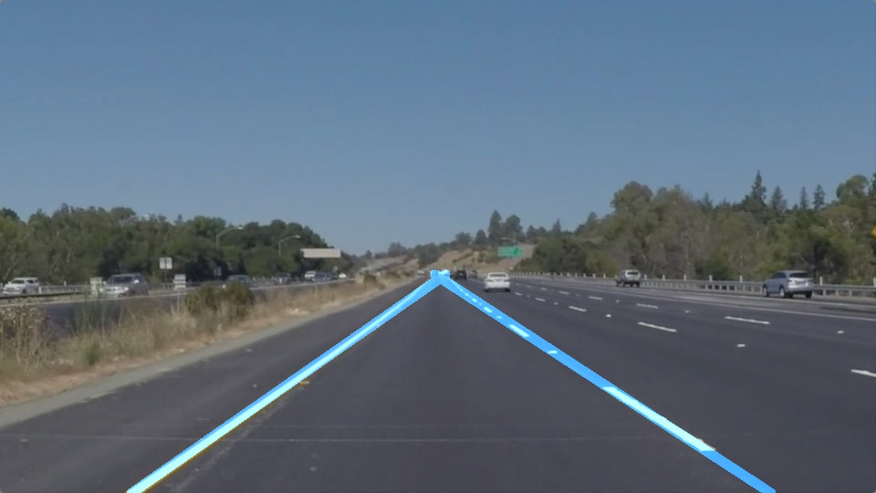

# Udacity - Self-Driving Car NanoDegree

Udacity's Self-Driving Car Nanodegree project files and notes.

This repository is a compilation of project files and lecture notes for [Udacity's Self-Driving Car Engineer Nanodegree program](https://www.udacity.com/drive) which I started working on January, 2018.

## Program Outline:
### Term 1: Deep Learning and Computer Vision

#### 1. Deep Learning
- `deep-learning-notes-and-labs`: Notes on Deep Learning, Tensorflow and Keras
- Project 2: Traffic Sign Classifier (Deep Learning)
- Project 3: Behavioural Cloning (Deep Learning)
    - Train a car to drive in a 3D simulator using a deep neural network. 
    - Input data comprises steering angles and camera images captured by driving with a keyboard / mouse / joystick in the simulator.

#### 2. Computer Vision
- `computer-vision-notes-and-labs`: Notes on Computer Vision
- Project 1: Finding Lane Lines (Intro to Computer Vision)
- Project 4: Advanced Lane Lines (Computer Vision)
- Project 5: Vehicle Detection (Computer Vision)

### Term 2: Sensor Fusion, Localisation and Control

#### 1. Sensor Fusion
- Combining lidar and radar data to track objects in the environment using Kalman filters.
#### 2. Localisation
- Locate a car relative to the world (Align a car and sensors to the map).
- Use particle filters to localise the vehicle.
#### 3. Control
- Fundamental concepts of robotic control.
- Build algorithms to steer car and wheels so as to meet an objective.

### Term 3: Path Planning, Controlling a Self-Driving Car
- Path Planning: Finding a sequence of steps in a maze (navigating cities, parking lots)
- Put your code in a self-driving car

# **Finding Lane Lines on the Road** 

Overview
---

When we drive, we use our eyes to decide where to go.  The lines on the road that show us where the lanes are act as our constant reference for where to steer the vehicle.  Naturally, one of the first things we would like to do in developing a self-driving car is to automatically detect lane lines using an algorithm.

In this project you will detect lane lines in images using Python and OpenCV.  OpenCV means "Open-Source Computer Vision", which is a package that has many useful tools for analyzing images.  

To complete the project, two files will be submitted: a file containing project code and a file containing a brief write up explaining your solution. We have included template files to be used both for the [code](https://github.com/udacity/CarND-LaneLines-P1/blob/master/P1.ipynb) and the [writeup](https://github.com/udacity/CarND-LaneLines-P1/blob/master/writeup_template.md).The code file is called P1.ipynb and the writeup template is writeup_template.md 

To meet specifications in the project, take a look at the requirements in the [project rubric](https://review.udacity.com/#!/rubrics/322/view)
